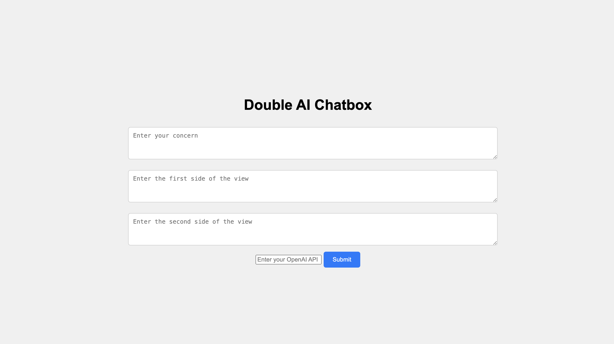
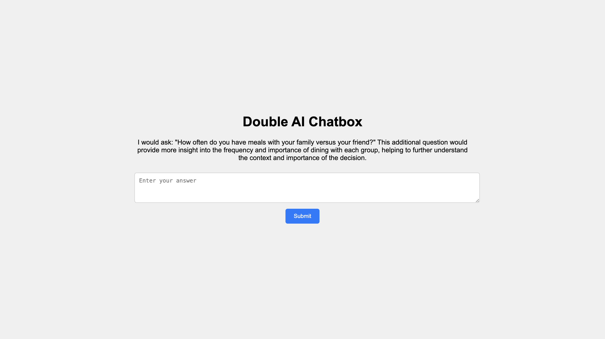
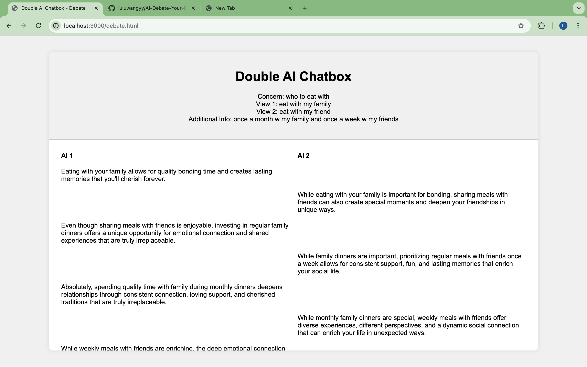

# AI Debate Your Dilemmas

## Introduction

"AI Debate Your Dilemmas" is a web application designed to help users resolve their internal conflicts by simulating a debate between two AI chatbots. Users input a concern and two opposing views on the concern, and the AI chatbots debate each side to reach a consensus. This project leverages the OpenAI GPT-3.5-turbo model to generate intelligent and meaningful responses from the AI chatbots.

## Features

- User inputs a concern and two opposing views.
- AI chatbots debate the views to reach a consensus.
- The debate can go up to 10 rounds.
- Customizable OpenAI API key input.

## Demo

### Step 1: Input Your Concern



### Step 2: Answer Additional Question



### Step 3: View the Debate



## Getting Started

### Prerequisites

- Node.js
- npm (Node Package Manager)

### Installation

1. Clone the repository:
   ```sh
   git clone https://github.com/yourusername/AI-Debate-Your-Dilemmas.git
   cd AI-Debate-Your-Dilemmas
2. Install the dependencies:
   npm install
3. Run
   npm start
